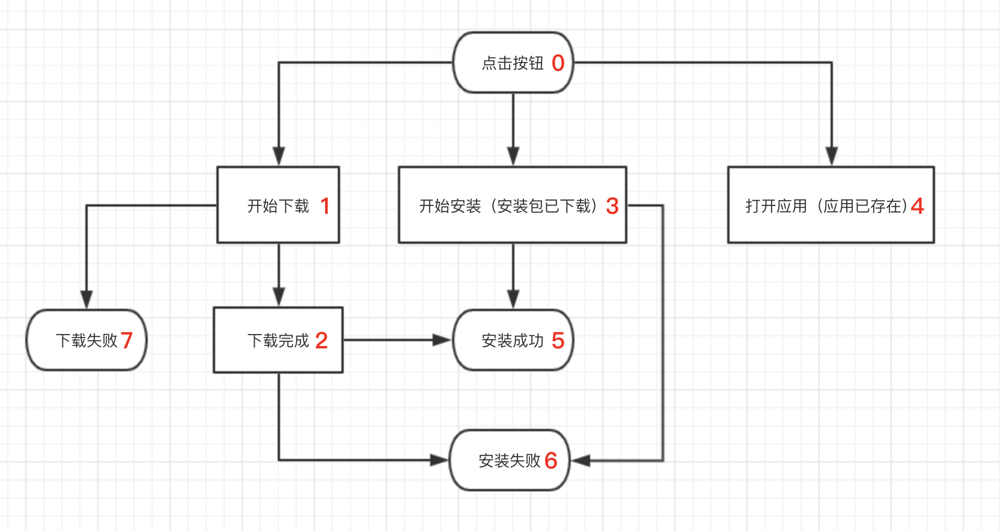
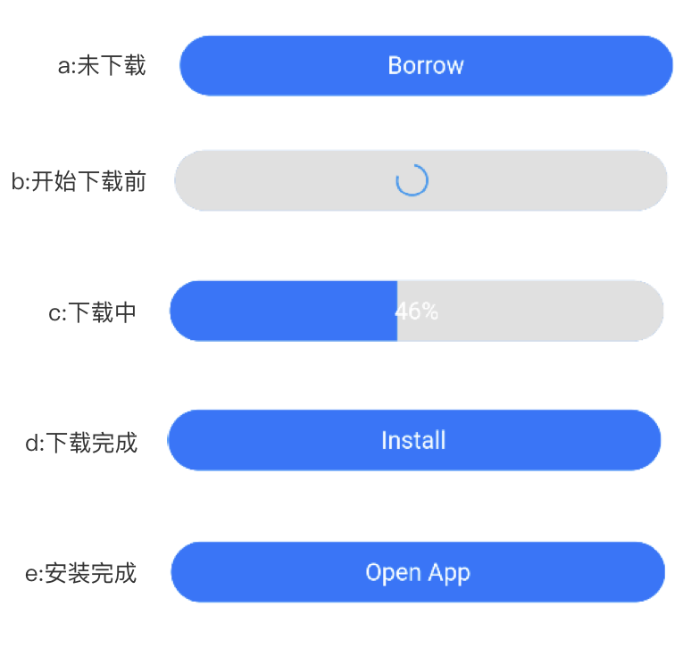

### 流程图

红色数字为tag值,`event_id`为`257`
埋点描述：
```
tag=0 APK下载方式(open_type=4)
tag=1 开始下载
tag=2 下载完成
tag=3 去安装（安装包已被下载）
tag=4 去打开应用（应用已安装在设备内）
tag=5 安装成功
tag=6 安装失败
tag=7 下载失败
field1 下载地址
field3 card_link_id
field4 包名
```
#### 相关状态，以及埋点

相关按钮状态见下图


- 1:当app未下载时，从开始下载到安装完成的按钮状态为`a->b->c->d->e`，对应埋点tag为`0,1,2,5`,注意这里没有`3(去安装)`，在当前页面下载完成时，自动安装apk
- 2:当apk已下载，按钮状态`d->e`,点击`Install`，对应埋点`0,3,5`或者（`0,3,6`安装失败的话）
- 3:当apk已安装, 按钮状态`e`, 点击`OpenApp`,对应埋点`0,4`

相关按钮状态如何切换：
| 按钮状态 | progress | 开始点击 | apk是否下载 | 说明
| --- |
|a| - | - | 否 |
|b| - | 是 | 否 | apk未下载，点击时显示圆形进度条
|c| 102，0～100 | 是 | 否 | 102:表示底层url下载链接解析完毕，开始下载。0～100为正常下载进度
|d| 101 | 否 | 是 | 如果第二次进入页面，可通过`android_webview`的`isDownloaded` 方法判断
|e| - | - | - | 首次安装: 通过`var result = await AndroidWebview.install(item.androidPackage)`返回结果判断是否已安装，第二次进入页面通过`isInstall = await AndroidWebview.isInstall(item.androidPackage)`判断安装状态

### 参考项目30029
[http://git.wuyouxinyong.net/android/flutter_cash.git](http://git.wuyouxinyong.net/android/flutter_cash/tree/30029)（30029分支）
具体代码`lib/pages/product_page.dart`,将`initState`方法中`todo`取消注释

关键代码
#### 1.清单文件配置Provider
`android/app/src/main`目录下修改`AndroidManifest.xml`文件
``` xml
<manifest xmlns:android="http://schemas.android.com/apk/res/android"
    >

    <application
        >
        <provider
            android:name="android.support.v4.content.FileProvider"
            android:authorities="${applicationId}.fileprovider"
            android:exported="false"
            android:grantUriPermissions="true">
            <meta-data
                android:name="android.support.FILE_PROVIDER_PATHS"
                android:resource="@xml/file_paths"/>
        </provider>
        ...
    </application>
</manifest>
```

#### 2. yaml引入`android_webview``1.0.0`版本
```
dependencies:
	android_webview: 1.0.0
```
### 3. 相关代码说明
#### 下载
``` java
// 跳转webview，如果open_type为4，开始下载任务
AndroidWebview.toWeb(
	item.platformName,
	item.openType,
	item.androidPackage,
	item.androidUrl);
```
#### 进度监听
``` java
AndroidWebview.eventChannel.receiveBroadcastStream().listen((map) {
      String id = map["id"];
      int p = map["progress"];
      if (id == item.androidPackage) {
        if (mounted)
          setState(() {
            progress = p;
            if (progress == 101) {//下载完成
              borrowText = I18n.install;
              isDownload = true;
              downloading = false;
              ProductApi.saveDownloadApk(2, item);
              installApk();
            } else if (progress >= 0 && progress < 101) {//下载中
              borrowText = "$progress%";
              downloading = true;
            } else if (progress == -1) {//下载失败
              //下载失败
              ProductApi.saveDownloadApk(7, item);
            } else if (progress == 102) {//开始下载
              ProductApi.saveDownloadApk(1, item);
            }
            loading = false;//隐藏圆形进度条
          });
      }
    });
```
#### 安装
``` java
void installApk() async {
    var result = await AndroidWebview.install(item.androidPackage);
    var tag = result ? 5 : 6;
    ProductApi.saveDownloadApk(tag, item);
    print("install:$result");
    if (mounted && result)
      setState(() {
        isInstall = true;
        borrowText = I18n.openApp;
      });
  }
```
#### 是否下载，是否安装
``` java
void initInstallState() async {
    isApk = item.openType == 4;
    if (isApk) {
      isDownload = await AndroidWebview.isDownloaded(item.androidPackage);//是否下载
      isInstall = await AndroidWebview.isInstall(item.androidPackage);//是否安装
    }
    setState(() {
      if (isApk) {
        if (isInstall)
          borrowText = I18n.openApp;
        else {
          if (isDownload) {
            borrowText = I18n.install;
          }
        }
      }
    });
  }
```

